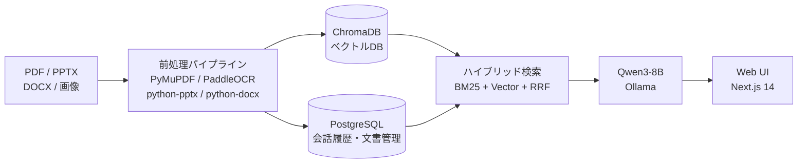
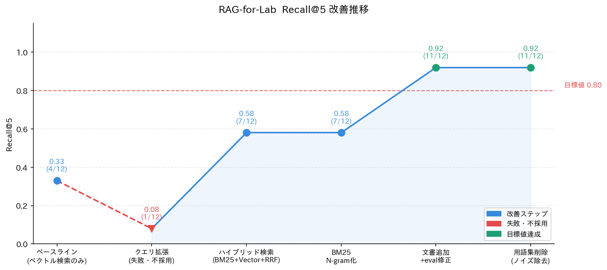

# RAG-for-Lab


> 研究室の過去知見（論文PDF・スライド・Word・紙の冊子）を自然言語で検索できる、
> ローカル完結・ゼロランニングコストの RAG システム。

## 概要

研究室には卒論PDF・発表スライド・Word文書・紙の冊子といった形で過去の知見が蓄積されているが、
それらは個人PCや共有フォルダに分散しており、検索性は実質的にゼロに近い。
B4・M1がテーマに関連する先行研究を把握するまでに数週間〜数ヶ月を要するのが現状で、
「すでに先輩が解決していた問題に再投資する」「過去の失敗を繰り返す」といったロスが恒常化していた。

本システムは、これらの分散知見を自然言語で検索・質問できる RAG として
研究室内に閉じた形で提供する。**ローカル完結・ゼロランニングコスト・フルOSS** を設計方針とし、
クラウドAPI料金や外部送信のリスクなしに、研究室の規模で常用できることを目指している。

## アーキテクチャ



```
            ┌──────────────────────────┐
            │  ブラウザ (Next.js :3000) │
            └────────────┬─────────────┘
                         │ REST + SSE
                         ▼
            ┌──────────────────────────┐
            │     FastAPI (:8000)      │
            └─┬──────────┬───────────┬─┘
              │          │           │
    ┌─────────▼──┐  ┌────▼─────┐  ┌──▼──────────────┐
    │ PostgreSQL │  │ ChromaDB │  │ Ollama          │
    │  (:5432)   │  │ (file)   │  │ (host :11434)   │
    │ 会話履歴・  │  │ ベクトル  │  │ Qwen3-8B        │
    │ メタデータ  │  │ index    │  │                 │
    └────────────┘  └──────────┘  └─────────────────┘

埋め込みモデル: multilingual-e5-large（backend コンテナ内で実行）
```

## 技術スタック

| コンポーネント | ツール | 選定理由 |
|--------------|--------|---------|
| LLM | Qwen3-8B (Ollama) | 日本語対応・128kコンテキスト・VRAM 5.5GB・無料 |
| 埋め込み | multilingual-e5-large | 日本語対応・VRAM 0.6GB・ローカル実行可 |
| ベクトルDB | ChromaDB | ローカルファイル動作・メタデータ管理が容易 |
| キーワード検索 | BM25（rank-bm25） | 固有名詞・数値の完全一致に強い |
| 検索統合 | RRF（Reciprocal Rank Fusion） | BM25とベクトルの順位を正規化して統合 |
| バックエンド | FastAPI | SSEストリーミング・非同期処理が容易 |
| フロントエンド | Next.js 14 | App Router・TypeScript・Tailwind |
| DB | PostgreSQL | 会話履歴・文書メタデータの永続化 |
| OCR | PaddleOCR | 日本語対応・信頼度スコア出力・無料 |
| コンテナ | Docker Compose | 環境再現性・Ollama以外を一括管理 |

## 主な機能

- **マルチフォーマット取り込み**: PDF / PPTX / DOCX / 画像（OCR）をドラッグ＆ドロップでインデックス化
- **ハイブリッド検索**: BM25（キーワード）+ ベクトル検索 + RRF で統合。固有名詞・数値に強い
- **ストリーミングチャット**: SSE によるトークン単位の応答 + 根拠チップ（文書名・章・ページ）表示
- **根拠の明示**: LLM に生成させず ChromaDB メタデータから生成（ハルシネーション防止）
- **OCR可視化・補正UI**: バウンディングボックス付きで OCR 結果を確認、手動補正後に再インデックス
- **会話履歴の保存・復元**: PostgreSQL でセッション単位の対話履歴を永続化

## 動作確認環境

| 項目 | 値 |
|------|-----|
| OS | Windows 11 / Ubuntu |
| GPU | NVIDIA RTX 3070（VRAM 8GB） |
| RAM | 32GB |
| Docker | 29.1.3 |
| Ollama | ホストPCで起動 |

## セットアップ

### 前提

- Docker Desktop（Windows/Mac）または Docker Engine（Linux）
- Ollama インストール済み

### 手順

```bash
# 1. モデルの取得
ollama pull qwen3:8b

# 2. リポジトリのクローン
git clone https://github.com/22fi028/RAG-for-Lab.git
cd RAG-for-Lab

# 3. 環境変数の設定
cp .env.example .env
# .env はデフォルト値のままで動作する

# 4. 起動
## Windows
toggle.bat をダブルクリック（または start.bat）

## Linux / Mac
docker compose up -d
```

ブラウザで http://localhost:3000 を開く。

### Linux での追加設定

`host.docker.internal` が使えない環境では `docker-compose.yml` の backend サービスに以下を追加すること:

```yaml
extra_hosts:
  - "host.docker.internal:host-gateway"
```

## 使い方

### 文書の追加

1. http://localhost:3000/admin を開く
2. PDF / PPTX / DOCX / 画像をドラッグ＆ドロップ
3. ステータスが `indexed` になれば検索可能

### 質問する

1. チャット画面で日本語で質問する
2. 回答の下に根拠チップ（文書名・章・ページ）が表示される
3. チップをクリックすると右パネルに該当箇所が表示される

### OCR文書の確認・補正

1. `/admin` の信頼度バッジをクリック → バウンディングボックス付きで OCR 結果を確認
2. 「テキストを編集」で手動補正
3. 「再インデックス」で反映

### 停止

```bash
# Windows
toggle.bat または stop.bat をダブルクリック

# Linux / Mac
docker compose down
```

## ディレクトリ構成

```
RAG-for-Lab/
├── backend/          # FastAPI
│   ├── app/
│   │   ├── core/     # 設定管理・リトライ
│   │   ├── models/   # SQLAlchemyモデル
│   │   ├── routers/  # APIエンドポイント
│   │   └── services/ # RAG・パイプライン・埋め込み
│   └── scripts/      # eval_recall.py・check_index.py
├── frontend/         # Next.js 14
├── data/             # ChromaDB・アップロードファイル（Git管理外）
├── config.yaml       # ハイパーパラメータ一元管理
└── docker-compose.yml
```

## 評価と改善

### Recall@5 の推移

評価セット12件に対する Retrieval 精度の改善推移。



| # | 状態 | Recall@5 | 主な変更 |
|---|------|---------|---------|
| ① | ベースライン | 4/12 = 0.33 | ベクトル検索のみ |
| ② | クエリ拡張 | 1/12 = 0.08 | 汎用語混入で悪化 → 不採用 |
| ③ | ハイブリッド検索導入 | 7/12 = 0.58 | BM25 + ベクトル + RRF |
| ④ | BM25 char N-gram 化 | 7/12 = 0.58 | スコア改善・recall変化なし |
| ⑤ | 文書追加 + eval修正 | 11/12 = 0.92 | 未取り込み文書3本を追加 |

**目標値（Recall@5 ≥ 0.80）達成済み。**

### 失敗から学んだこと

クエリ拡張（0.33 → 0.08）が失敗した理由: LLM が「サンプリングレート」→「定義・とは・検索」のような汎用語を生成し、
埋め込みベクトルが正解チャンクの固有名詞（96kHz）から離れた。
「ベクトル検索の問題」ではなく「キーワード完全一致で解くべき問題」だったため、
BM25 の追加が正しいアプローチだった。

### 評価コマンド

```bash
# Recall@5 計測
docker compose exec backend python scripts/eval_recall.py

# デバッグモード（MISSした質問のTop-5を表示）
docker compose exec backend python scripts/eval_recall.py --debug

# ChromaDBのキーワード存在確認
docker compose exec backend python scripts/check_index.py
```

### 残課題

- **synonym ギャップ**: 「サンプリングレートは？」→ 本文には「96kHz」しかなく MISS。対策候補: HyDE（仮想回答でベクトル検索）
- **2列レイアウト論文の OCR 読み順**: 左右列の同一行が混在するケースが残存

## 今後の展望

- HyDE 導入: synonym ギャップの解消
- 学内サーバー移行: 複数人同時アクセス対応
- Kubernetes: `infra/k8s/` に参考マニフェストを配置予定
- Notion 連携: API 経由エクスポートの自動取り込み
- 認証機能: 学内メンバー限定アクセス
