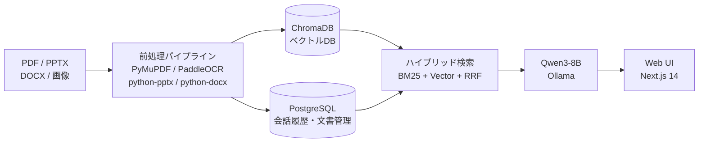

# RAG-for-Lab

研究室の過去知見（論文PDF・スライド・Word・紙の冊子）を自然言語で検索できる、
ローカル完結・ゼロランニングコストのRAGシステム。

## システム構成



## 技術スタック

| レイヤー | 技術 |
|---------|------|
| Backend | FastAPI + PostgreSQL + ChromaDB |
| LLM | Qwen3-8B (Q4_K_M) via Ollama |
| Embedding | intfloat/multilingual-e5-large |
| Frontend | Next.js 14 (TypeScript / Tailwind CSS) |
| Infra | Docker Compose (Windows 11 / RTX 3070) |

## 検索精度（Recall@5）

評価セット12件に対するRetrieval精度の改善推移。


| ステップ | Recall@5 | 主な変更 |
|---------|---------|---------|
| ベースライン | 0.33 | ベクトル検索のみ |
| クエリ拡張 | 0.08 | 汎用語混入で悪化 → 不採用 |
| ハイブリッド検索導入 | 0.58 | BM25 + Vector + RRF |
| BM25 N-gram化 | 0.58 | char 2-gram + 3-gram トークナイザ |
| 文書追加 + eval修正 | 0.92 | 未取込文書3本追加・評価セット修正 |
| 用語集削除 | 0.92 | BM25ノイズ源を排除 |

目標値（Recall@5 ≥ 0.80）達成済み。

## 主な機能

- **マルチフォーマット対応**: PDF・PPTX・DOCX・画像（OCR）のインデックス化
- **ハイブリッド検索**: BM25 + ベクトル検索をRRFで統合。固有名詞・数値に強い
- **ストリーミング回答**: SSEによるトークン逐次表示
- **根拠の明示**: 回答に文書名・章・ページ番号を付与（LLMに生成させずChromaDBメタデータから生成）
- **OCR品質管理**: 信頼度スコアの可視化・テキスト補正・再インデックス
- **会話履歴**: PostgreSQLによる永続化・複数会話の管理

## セットアップ

### 前提条件

- Docker Desktop
- Ollama（ホストPCにインストール済み）
- NVIDIA GPU（VRAM 8GB以上推奨）

### 手順

```bash
# 1. モデルの取得
ollama pull qwen3:8b

# 2. リポジトリのクローン
git clone https://github.com/<your-username>/RAG-for-Lab.git
cd RAG-for-Lab

# 3. 環境変数の設定
cp .env.example .env
# .env を編集（デフォルト値のままでも動作する）

# 4. 起動
docker compose up -d
```

ブラウザで http://localhost:3000 を開く。

### Windowsの場合（デスクトップショートカット）

`toggle.bat` のショートカットをデスクトップに配置済み。
ダブルクリックで起動・停止をトグルできる。

## ディレクトリ構成

```
RAG-for-Lab/
├── backend/          # FastAPI
│   ├── app/
│   │   ├── core/     # 設定管理・リトライ
│   │   ├── models/   # SQLAlchemyモデル
│   │   ├── routers/  # APIエンドポイント
│   │   └── services/ # RAG・パイプライン・埋め込み
│   └── scripts/      # eval_recall.py・check_index.py
├── frontend/         # Next.js 14
├── data/             # ChromaDB・アップロードファイル（Git管理外）
├── config.yaml       # ハイパーパラメータ一元管理
└── docker-compose.yml
```

## 評価・検証

```bash
# Recall@5 計測
docker compose exec backend python scripts/eval_recall.py

# デバッグモード（MISSした質問のTop-5を表示）
docker compose exec backend python scripts/eval_recall.py --debug

# ChromaDBのキーワード存在確認
docker compose exec backend python scripts/check_index.py
```

## 今後の拡張予定

- synonymギャップ対策（HyDE: 仮想回答生成 → ベクトル検索）
- 学内サーバーへの移行・Kubernetes構成
- 認証機能（学内メンバー限定アクセス）
- Notion連携
